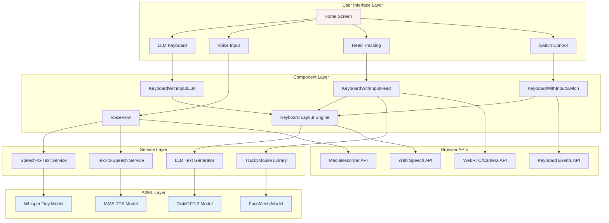
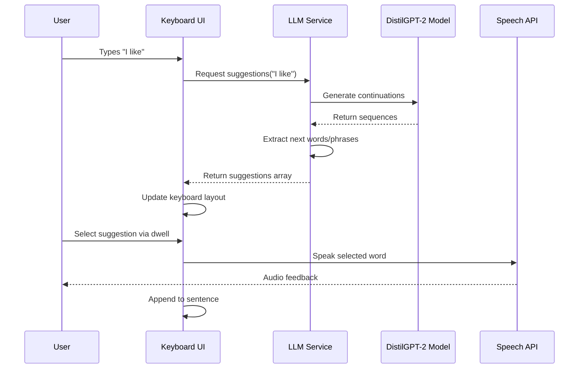
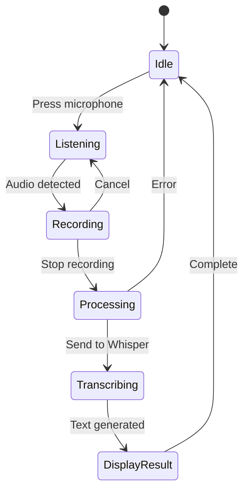
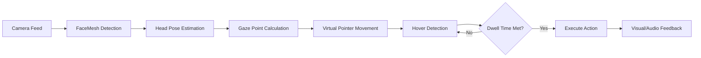
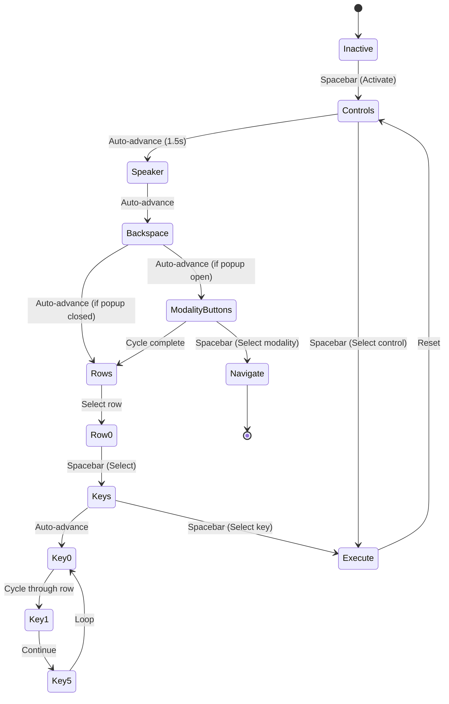
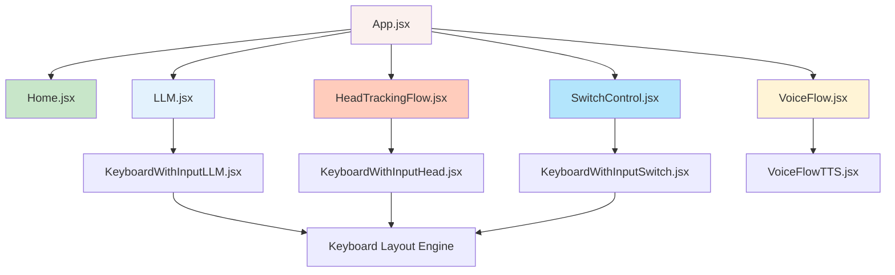
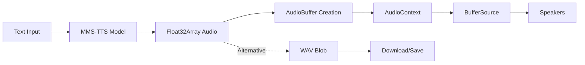
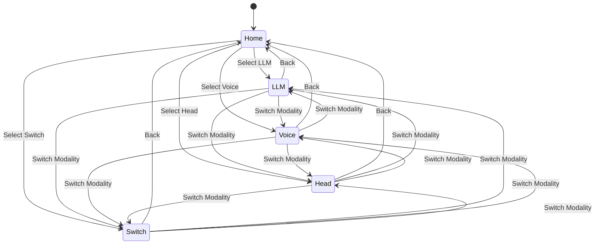
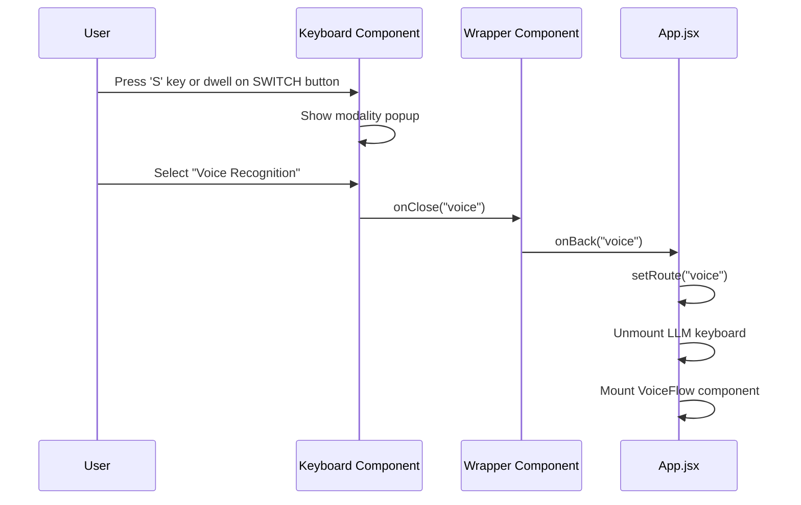

# Multi-Modal Accessibility Keyboard System

## Technical Documentation & System Architecture


---

## Table of Contents

1. [Project Overview](#project-overview)
2. [System Architecture](#system-architecture)
3. [File Structure](#file-structure)
4. [Technology Stack](#technology-stack)
5. [Core Features & Modalities](#core-features--modalities)
6. [Component Architecture](#component-architecture)
7. [Service Layer](#service-layer)
8. [Navigation Flow](#navigation-flow)
9. [State Management](#state-management)
10. [Accessibility Features](#accessibility-features)
11. [Performance Optimizations](#performance-optimizations)
12. [Setup & Installation](#setup--installation)

---

## Project Overview

This is a **comprehensive multi-modal accessibility keyboard application** designed to provide alternative input methods for users with diverse abilities. The system supports four distinct input modalities:

1. **LLM-Powered Keyboard** - AI-assisted text prediction using GPT-2
2. **Voice Recognition** - Speech-to-text input using Whisper AI
3. **Head Tracking** - Gaze-based control using TrackyMouse
4. **Switch Control** - Single-button navigation for motor-impaired users

### Primary Goals

- **Accessibility First**: Provide multiple input methods for users with varying abilities
- **Browser-Based**: No installation required, runs entirely in the browser
- **Offline-Capable**: Uses local AI models (Transformers.js) for privacy and offline functionality
- **Real-Time Feedback**: Audio and visual feedback for all interactions
- **Customizable**: Adjustable dwell times, sensitivities, and delays

---

## System Architecture



### Architecture Layers

#### 1. **Presentation Layer** (React Components)

- Home screen with modality selection
- Four specialized keyboard interfaces
- Settings panels and popups
- Visual feedback systems (hover effects, dwell timers)

#### 2. **Business Logic Layer**

- Keyboard layout management (24 predefined layouts)
- Context-aware layout switching
- Dwell-based interaction logic
- Switch navigation state machine
- Audio feedback management

#### 3. **Service Layer** (Singleton Services)

- LLM text generation (next-word prediction)
- Speech recognition (audio → text)
- Text-to-speech synthesis (text → audio)
- Head tracking integration

#### 4. **AI/ML Layer** (Transformers.js)

- Client-side model inference
- No server required
- Privacy-preserving
- Offline-capable after initial model download

---

## File Structure

```
App/
├── public/
│   └── tracky-mouse/           # TrackyMouse head tracking library
│       ├── facemesh.worker.js  # Web Worker for face detection
│       ├── tracky-mouse.js     # Core tracking logic
│       ├── tracky-mouse.css    # Pointer styles
│       └── lib/                # ML models and dependencies
│           ├── facemesh/       # Google FaceMesh model
│           ├── clmtrackr.js    # Face tracking algorithm
│           └── tf.js           # TensorFlow.js
│
├── src/
│   ├── main.jsx                # Application entry point
│   ├── App.jsx                 # Root component & routing logic
│   ├── App.css                 # Global styles
│   ├── index.css               # CSS reset & base styles
│   │
│   ├── components/             # React components
│   │   ├── Home.jsx            # Landing page with modality selection
│   │   ├── Home.css            # Home page styles
│   │   │
│   │   ├── LLM.jsx             # LLM modality wrapper
│   │   ├── KeyboardWithInputLLM.jsx    # LLM keyboard implementation
│   │   │
│   │   ├── VoiceFlow.jsx       # Voice input interface
│   │   ├── VoiceFlow.css       # Voice interface styles
│   │   ├── VoiceFlowTTS.jsx    # TTS integration component
│   │   │
│   │   ├── HeadTrackingFlow.jsx        # Head tracking wrapper
│   │   ├── KeyboardWithInputHead.jsx   # Head tracking keyboard
│   │   ├── KeyboardWithInputHead.css   # Head-specific styles
│   │   │
│   │   ├── SwitchControl.jsx   # Switch control wrapper
│   │   ├── SwitchControl.css   # Switch control styles
│   │   ├── KeyboardWithInputSwitch.jsx # Switch keyboard
│   │   │
│   │   ├── Keyboard.css        # Shared keyboard styles
│   │   └── KeyboardWithInput.css       # Keyboard component styles
│   │
│   ├── services/               # Business logic services
│   │   ├── llmTextGenerator.js         # GPT-2 text prediction
│   │   ├── speechToTextService.js      # Whisper STT
│   │   └── textToSpeechService.js      # MMS-TTS synthesis
│   │
│   ├── icons/                  # UI icons (PNG/SVG)
│   │   ├── ai.png              # LLM icon
│   │   ├── voice-recognition.png       # Microphone icon
│   │   ├── face-id.png         # Head tracking icon
│   │   ├── button.png          # Switch control icon
│   │   └── ...                 # Keyboard key icons
│   │
│   ├── sounds/                 # Audio feedback
│   │   └── ui-pop-sound-316482.mp3     # Hover/selection sound
│   │
│   └── assets/                 # Static assets
│
├── package.json                # Dependencies & scripts
├── vite.config.js              # Vite build configuration
├── eslint.config.js            # ESLint rules
└── index.html                  # HTML entry point
```

---

## Technology Stack

### Core Framework

| Technology            | Version | Purpose                                       |
| --------------------- | ------- | --------------------------------------------- |
| **React**             | 19.1.1  | UI framework for component-based architecture |
| **Vite**              | 7.1.14  | Fast build tool with HMR                      |
| **JavaScript (ES6+)** | -       | Primary programming language                  |

### AI/ML Libraries

| Library                       | Version   | Purpose                                     |
| ----------------------------- | --------- | ------------------------------------------- |
| **@xenova/transformers**      | 2.17.2    | Client-side AI models (GPT-2, Whisper, TTS) |
| **@huggingface/transformers** | 3.7.6     | Alternative transformer implementation      |
| **TrackyMouse**               | 1.2.0     | Head/gaze tracking library                  |
| **TensorFlow.js**             | (bundled) | ML inference engine for FaceMesh            |

### Browser APIs

- **Web Speech API** - Built-in TTS for immediate feedback
- **MediaRecorder API** - Audio recording for Whisper STT
- **getUserMedia API** - Camera access for head tracking
- **Keyboard Events API** - Switch control input
- **AudioContext API** - Audio processing and playback

### Build Tools

| Tool              | Purpose                                      |
| ----------------- | -------------------------------------------- |
| **Rolldown-Vite** | Optimized Vite build with better performance |
| **ESLint**        | Code quality and consistency                 |
| **PostCSS**       | CSS processing                               |
| **Autoprefixer**  | CSS vendor prefixing                         |

---

## Core Features & Modalities

### 1. LLM-Powered Keyboard



**Features:**

- **AI-Powered Predictions**: Uses DistilGPT-2 (smaller, faster GPT-2)
- **Context-Aware**: Generates 1-3 word phrase suggestions
- **Dynamic Layouts**: Keyboard adapts based on sentence context
- **Dwell Selection**: Hover for 2.5s to select keys
- **Visual Feedback**: Keys highlight on hover with fill animation
- **Audio Feedback**: Pop sound + TTS speak selected word

**Implementation Details:**

- **Model**: `Xenova/distilgpt2` (~80MB)
- **Temperature**: 0.9 (balanced creativity)
- **Top-K**: 60 (limits vocabulary pool)
- **Top-P**: 0.95 (nucleus sampling)
- **Repetition Penalty**: 1.3 (reduces repetition)

### 2. Voice Recognition Input



**Features:**

- **Speech-to-Text**: Whisper Tiny model for fast transcription
- **Real-Time Recording**: Visual feedback during recording
- **Audio Playback**: Review recorded audio before transcription
- **TTS Integration**: Speak transcribed text back to user
- **Modality Switching**: Quick switch to other input methods

**Technical Specs:**

- **Model**: `Xenova/whisper-tiny.en` (~150MB)
- **Sample Rate**: 16kHz (Whisper requirement)
- **Chunk Length**: 30 seconds
- **Stride Length**: 5 seconds (overlap for accuracy)
- **Audio Format**: WebM/MP3 → Float32Array conversion

### 3. Head Tracking Keyboard



**Features:**

- **Hands-Free Operation**: Control via head movements
- **TrackyMouse Integration**: Advanced gaze tracking library
- **Custom Pointer**: Red circular cursor with dwell fill animation
- **Adjustable Sensitivity**: Horizontal/vertical sensitivity controls
- **Acceleration Curve**: Smooth pointer movement
- **Configurable Dwell**: 2-8 second range
- **Settings UI**: In-app camera preview and calibration

**Technical Implementation:**

- **Face Detection**: Google FaceMesh (468 facial landmarks)
- **Tracking Rate**: ~30 FPS
- **Pointer Rendering**: CSS-based cursor with z-index override
- **Device Cursor**: Hidden globally, shown only in settings popup
- **Auto-Initialization**: F9 key simulation to start tracking

### 4. Switch Control Navigation



**Features:**

- **Single-Button Access**: Entire interface navigable via spacebar
- **Auto-Scan Mode**: Automatic cycling through options
- **Hierarchical Navigation**: Controls → Rows → Keys
- **Visual Highlighting**: Yellow border on current selection
- **Modality Popup Support**: Navigate between input modes
- **Configurable Delay**: 0.5-5 second scan speed
- **Separate Dwell Timer**: Independent timing for key selection

**State Machine:**

```javascript
States: {
  switchMode: boolean,           // Switch access enabled
  switchActivated: boolean,      // Scanning active
  highlightMode: 'controls' | 'rows' | 'keys' | 'modality',
  currentHighlight: string | number | null,
  selectedRow: number | null
}

Transitions:
- Spacebar (first press) → Activate scanning
- Spacebar (in controls) → Select control
- Spacebar (in rows) → Drill into keys
- Spacebar (in keys) → Execute key action
- Auto-timer → Advance highlight
```

---

## Component Architecture

### Component Hierarchy



### Key Components

#### App.jsx (Root Component)

**Responsibilities:**

- Route management (home, llm, voice, head, switch)
- Global audio initialization
- Modality switching logic
- Pass `audioEnabled` state to all children

**State:**

```javascript
{
  route: 'home' | 'llm' | 'voice' | 'head' | 'switch',
  audioEnabled: boolean,
  audioInitializedRef: useRef(false)
}
```

#### Home.jsx (Landing Page)

**Responsibilities:**

- Display 4 modality options as cards
- Dwell-based selection (3-second default)
- Audio feedback on hover
- Icon-based visual design

**Features:**

- Large pink cards with extrusion effect
- Icons for each modality
- Hover detection with 3s dwell timer
- TTS announcement of selected modality

#### KeyboardWithInput Components

**Shared Features:**

- 24-key grid layout (4 rows × 6 keys)
- Input display at top
- Speaker button (read sentence)
- Backspace button (remove last word)
- Settings popup
- Time popup
- Modality switch popup

**Keyboard Layouts:**

```javascript
KEYBOARD_LAYOUTS = {
  default: [], // Initial layout
  afterI: [], // After typing "I"
  afterILike: [], // After typing "I like"
  vocab: [], // General vocabulary
  afterILikeToPlay: [], // After "I like to play"
  // ... 19 more layouts
};
```

**Color Coding:**

- **Yellow** (#fff4d6): Pronouns (I, you, me)
- **Green** (#c8e6c9): Verbs, nouns (eat, play, bicycle)
- **Purple** (#e1bee7): Adjectives (good, sad, happy)
- **Orange** (#ffd699): Categories (TIME, COLORS)
- **Red/Pink** (#ffccbc): Actions (EXIT, HOME, CLEAR)
- **Blue** (#b3e5fc): Special (SWITCH MODALITY)
- **Gray** (#f5f5f5): Function words (and, to, can)

#### LLM.jsx / HeadTrackingFlow.jsx / SwitchControl.jsx (Wrappers)

**Purpose:** Provide parent-level logic and pass modality change handler

**Structure:**

```javascript
function Wrapper({ onBack, audioEnabled }) {
  const handleModalityChange = (modality) => {
    onBack && onBack(modality);
  };

  return (
    <KeyboardComponent
      onClose={handleModalityChange}
      audioEnabled={audioEnabled}
    />
  );
}
```

#### VoiceFlow.jsx (Voice Interface)

**Unique Features:**

- Recording controls (start/stop/playback)
- Waveform visualization
- Transcription display
- TTS playback of transcribed text
- Direct text input option
- Modality switch button with popup

**State Management:**

```javascript
{
  isRecording: boolean,
  audioBlob: Blob | null,
  audioUrl: string | null,
  transcribedText: string,
  isTranscribing: boolean,
  error: string | null,
  hoveredElement: string | null,
  showModalityPopup: boolean
}
```

---

## Service Layer

### LLM Text Generator Service (`llmTextGenerator.js`)

**Design Pattern:** Singleton
**Purpose:** Generate next-word predictions using DistilGPT-2

#### Class Structure

```javascript
class LLMTextGenerator {
  constructor() {
    this.pipeline = null;
    this.initPromise = null;
    this.isReady = false;
    this.modelId = "Xenova/distilgpt2";
  }

  async initialize()
  async getSuggestions(inputText, numSuggestions = 8)
  addPrimingContext(inputText)
  extractNextWordsAndPhrases(primedText, outputs, originalInput)
  async getMultipleSuggestions(inputText, count = 18)
  async dispose()
}
```

#### Key Methods

**`initialize()`**

- Lazy-loads the GPT-2 model (first use only)
- Downloads ~80MB model from HuggingFace CDN
- Shows download progress via console
- Returns promise that resolves when ready

**`getSuggestions(inputText, numSuggestions)`**

- Adds priming context for short inputs
- Generates 4× requested sequences (better diversity)
- Extracts 1-word, 2-word, and 3-word phrases
- Filters duplicates and invalid suggestions
- Returns array of string suggestions

**Priming Strategy:**

```javascript
// For short inputs (1-2 words), add context
Input: "I";
Primed: "In a conversation, someone might say: I";

// Model then generates: "I like", "I want", "I need"
```

**Extraction Strategy:**

```javascript
Generated: "I like to play with my dog and"
After "I": "like to play with my dog and"
Extracted suggestions:
  - "like"              (1-word)
  - "like to"           (2-word)
  - "like to play"      (3-word)
  - "play"              (1-word)
  - "play with"         (2-word)
```

#### Configuration

```javascript
pipeline(text, {
  max_new_tokens: 25, // Generate up to 25 new tokens
  num_return_sequences: 32, // 8 suggestions × 4 diversity
  temperature: 0.9, // Balanced creativity
  top_k: 60, // Consider top 60 tokens
  top_p: 0.95, // Nucleus sampling threshold
  do_sample: true, // Enable sampling
  repetition_penalty: 1.3, // Discourage repetition
});
```

### Speech-to-Text Service (`speechToTextService.js`)

**Design Pattern:** Singleton
**Purpose:** Convert audio recordings to text using Whisper

#### Class Structure

```javascript
class SpeechToTextService {
  constructor() {
    this.transcriber = null;
    this.initPromise = null;
    this.isReady = false;
    this.modelId = "Xenova/whisper-tiny.en";
  }

  async initialize()
  async convertBlobToAudio(audioBlob)
  async transcribeFile(audioFile)
  async transcribeUrl(audioUrl)
  async transcribeWithTimestamps(audio)
  async transcribeRecording(audioBlob)
  async dispose()
}
```

#### Audio Processing Pipeline

```mermaid
graph LR
    A[MediaRecorder] -->|WebM/MP3 Blob| B[convertBlobToAudio]
    B -->|ArrayBuffer| C[AudioContext]
    C -->|decodeAudioData| D[AudioBuffer]
    D -->|getChannelData| E[Float32Array]
    E -->|16kHz mono| F[Whisper Model]
    F -->|Text chunks| G[Concatenate]
    G --> H[Final Transcription]
```



#### Key Methods

**`convertBlobToAudio(audioBlob)`**

- Creates AudioContext with 16kHz sample rate (Whisper requirement)
- Converts Blob → ArrayBuffer → AudioBuffer
- Extracts mono channel as Float32Array
- Returns audio data ready for Whisper

**`transcribeFile(audioFile)`**

- Processes audio in 30-second chunks
- Uses 5-second stride for overlap (improves accuracy)
- Returns plain text transcription
- Handles long recordings automatically

**Whisper Configuration:**

```javascript
transcriber(audioData, {
  chunk_length_s: 30, // Process 30s at a time
  stride_length_s: 5, // 5s overlap between chunks
  return_timestamps: false, // Plain text output
});
```

### Text-to-Speech Service (`textToSpeechService.js`)

**Design Pattern:** Singleton
**Purpose:** Convert text to synthesized speech using MMS-TTS

#### Class Structure

```javascript
class TextToSpeechService {
  constructor() {
    this.synthesizer = null;
    this.initPromise = null;
    this.isReady = false;
    this.modelId = "Xenova/mms-tts-eng";
  }

  async initialize()
  async synthesize(text)
  async speak(text)
  async synthesizeToBlob(text)
  floatArrayToWav(audioData, sampleRate)
  async dispose()
}
```

#### Synthesis Pipeline



#### Key Methods

**`speak(text)`**

- Synthesizes text to audio
- Creates AudioBuffer from Float32Array
- Plays through AudioContext
- Returns promise that resolves when complete
- Sample rate: 16kHz

**`synthesizeToBlob(text)`**

- Generates WAV file from synthesized audio
- Useful for downloading/saving speech
- Returns Blob with proper WAV header

**WAV Conversion:**

```javascript
floatArrayToWav(audioData, sampleRate) {
  // Create WAV header (44 bytes)
  // - RIFF chunk descriptor
  // - fmt sub-chunk (PCM, mono, 16-bit)
  // - data sub-chunk
  // Convert Float32Array to 16-bit PCM
  // Return as Blob
}
```

---

## Navigation Flow

### Application State Machine



### Routing Logic (App.jsx)

```javascript
function App() {
  const [route, setRoute] = useState("home");

  // Direct modality switching
  const handleBackOrSwitch = (modality) => {
    if (modality && modality !== "home") {
      setRoute(modality); // Switch to different modality
    } else {
      setRoute("home"); // Return to home
    }
  };

  // Conditional rendering based on route
  if (route === "llm") return <LLM onBack={handleBackOrSwitch} />;
  if (route === "voice") return <VoiceFlow onBack={handleBackOrSwitch} />;
  if (route === "head") return <HeadTrackingFlow onBack={handleBackOrSwitch} />;
  if (route === "switch") return <SwitchControl onBack={handleBackOrSwitch} />;

  return <Home onSelectModality={setRoute} />;
}
```

### Modality Switch Flow



---

## State Management

### Global State (App.jsx)

```javascript
{
  route: string,              // Current active modality
  audioEnabled: boolean,      // Global audio permission
  audioInitializedRef: Ref    // Audio context initialization
}
```

### Keyboard Component State

```javascript
{
  // Content state
  sentence: string,                    // Current sentence being built
  currentLayout: string,               // Active keyboard layout ID
  currentKeys: Array<KeyObject>,       // Current key configuration

  // Interaction state
  hoveredElement: string | null,       // Currently hovered element ID
  dwellTime: number,                   // Dwell timer duration (ms)

  // Popup state
  showTimePopup: boolean,              // Time display popup
  showSettingsPopup: boolean,          // Settings panel
  showModalityPopup: boolean,          // Modality switch popup
  showInstructionsPopup: boolean,      // Instructions (switch mode)

  // Time data
  currentTime: {
    time: string,                      // Formatted time
    day: string,                       // Day of week
    date: string                       // Full date
  },

  // Refs
  mouseRef: useRef({ x, y }),          // Mouse position
  dwellTimerRef: useRef(null),         // Dwell timeout
  hoverSoundRef: useRef(null),         // Audio element
  speechSynthRef: useRef(null),        // Web Speech API
  inputRef: useRef(null)               // Input element reference
}
```

### LLM-Specific State

```javascript
{
  llmReady: boolean,                   // LLM model loaded
  isGeneratingSuggestions: boolean,    // Loading state
  showLLMLoading: boolean              // Loading popup
}
```

### Voice Component State

```javascript
{
  isRecording: boolean,                // Recording active
  audioBlob: Blob | null,              // Recorded audio
  audioUrl: string | null,             // Blob URL for playback
  transcribedText: string,             // Whisper output
  isTranscribing: boolean,             // Processing state
  error: string | null                 // Error message
}
```

### Head Tracking State

```javascript
{
  trackyMouseEnabled: boolean,         // Tracking active
  trackyMouseReady: boolean,           // Library loaded
  showSetupCompletePopup: boolean,     // Setup confirmation

  trackySettings: {
    horizontalSensitivity: number,     // 0-100
    verticalSensitivity: number,       // 0-100
    acceleration: number,              // 0-100
    dwellTime: number                  // 2000-8000 ms
  },

  trackyMouseRef: useRef(null),        // TrackyMouse instance
  dwellClickerRef: useRef(null)        // Dwell clicker instance
}
```

### Switch Control State

```javascript
{
  switchMode: boolean,                 // Switch access enabled
  switchActivated: boolean,            // Scanning active
  currentHighlight: string | number | null,  // Current selection
  highlightMode: string,               // 'controls' | 'rows' | 'keys' | 'modality'
  selectedRow: number | null,          // Selected row in drill-down
  switchDelay: number,                 // Auto-advance delay (ms)

  switchTimerRef: useRef(null),        // Auto-scan timer
  showSwitchStatusPopup: boolean,      // Status message
  switchStatusMessage: string          // Status text
}
```

---

## Accessibility Features

### 1. Dwell-Based Selection

**Purpose:** Click-free interaction for users unable to use mouse buttons

**Implementation:**

```javascript
useEffect(() => {
  if (!hoveredElement) return;

  const duration =
    element === "backspace-btn"
      ? BACKSPACE_DWELL_TIME // 2 seconds
      : dwellTime; // Configurable (2-8s)

  const timer = setTimeout(() => {
    executeAction(hoveredElement);
  }, duration);

  return () => clearTimeout(timer);
}, [hoveredElement]);
```

**Visual Feedback:**

- Cursor fills from bottom to top during dwell
- CSS clip-path animation shows progress
- Audio pop on hover start

### 2. Visual Cursor Fill Animation

```css
.tracky-mouse-pointer {
  width: 40px;
  height: 40px;
  background: red;
  border-radius: 50%;
  clip-path: var(--cursor-fill, inset(100% 0 0 0 round 50%));
  transition: clip-path var(--dwell-duration, 0ms) linear;
}

/* Filled state */
clip-path: inset(0 0 0 0 round 50%);
```

### 3. Audio Feedback

**Types:**

1. **Hover Sound**: UI pop sound on element hover
2. **TTS Announcement**: Web Speech API speaks key labels
3. **Status Messages**: Voice feedback for actions

**Implementation:**

```javascript
const speakText = (text) => {
  if (!speechSynthRef.current) return;

  speechSynthRef.current.cancel(); // Stop current speech

  const utterance = new SpeechSynthesisUtterance(text);
  utterance.rate = 0.9;
  utterance.pitch = 1.0;
  utterance.volume = 1.0;

  speechSynthRef.current.speak(utterance);
};
```

### 4. High Contrast Visual Design

- Large buttons (min 80px × 80px)
- 3px solid black borders
- Color-coded categories
- Clear icon + text labels
- Box-shadow for depth

### 5. Keyboard Shortcuts

| Key        | Action                     | Context        |
| ---------- | -------------------------- | -------------- |
| `S`        | Open modality switch popup | All keyboards  |
| `V`        | Close modality popup       | All keyboards  |
| `C`        | Open modality popup        | Head tracking  |
| `Spacebar` | Activate/advance/select    | Switch control |
| `F9`       | Start/stop head tracking   | Head tracking  |

### 6. Adjustable Settings

**Configurable Parameters:**

- Dwell time (2-8 seconds)
- Switch delay (0.5-5 seconds)
- Head tracking sensitivity (horizontal/vertical)
- Head tracking acceleration curve

### 7. Multi-Modal Input

**Users can choose the modality that works best for them:**

- **Motor impairment** → Switch control or head tracking
- **Speech impairment** → LLM keyboard or voice input
- **Visual impairment** → Audio feedback + high contrast
- **Cognitive impairment** → Simple, consistent layouts

---

## Performance Optimizations

### 1. Model Loading Strategy

**Lazy Loading:**

```javascript
// Models load only when modality is first used
async initialize() {
  if (this.pipeline) return true;  // Already loaded
  if (this.initPromise) return this.initPromise;  // Loading in progress

  this.initPromise = (async () => {
    this.pipeline = await pipeline("text-generation", this.modelId);
    this.isReady = true;
    return true;
  })();

  return this.initPromise;
}
```

**Progressive Model Download:**

- Models stream from HuggingFace CDN
- Progress callbacks show download status
- Cached in browser after first load
- No re-download on subsequent visits

### 2. React Optimization

**Memoization:**

```javascript
// Prevent unnecessary re-renders
const memoizedKeys = useMemo(() => {
  return currentKeys.map((key) => ({ ...key }));
}, [currentKeys]);

// Stable callback references
const handleKeyClick = useCallback(
  (keyId) => {
    executeKeyAction(keyId);
  },
  [sentence, currentKeys]
);
```

**Conditional Rendering:**

```javascript
// Only render active modality
if (route === "llm") return <LLM />;
if (route === "voice") return <VoiceFlow />;
// Others unmounted, freeing memory
```

### 3. Animation Performance

**CSS vs JavaScript:**

```css
/* Hardware-accelerated CSS */
.keyboard-key {
  transform: translateY(0);
  transition: transform 0.2s ease;
}

.keyboard-key:hover {
  transform: translateY(-4px); /* GPU-accelerated */
}
```

**RequestAnimationFrame for hover detection:**

```javascript
useEffect(() => {
  const checkHover = () => {
    const { x, y } = mouseRef.current;
    // Check element bounds
    rafRef.current = requestAnimationFrame(checkHover);
  };

  rafRef.current = requestAnimationFrame(checkHover);
  return () => cancelAnimationFrame(rafRef.current);
}, [hoveredElement]);
```

### 4. Memory Management

**Cleanup on unmount:**

```javascript
useEffect(() => {
  return () => {
    if (dwellTimerRef.current) clearTimeout(dwellTimerRef.current);
    if (rafRef.current) cancelAnimationFrame(rafRef.current);
    if (hoverSoundRef.current) hoverSoundRef.current = null;
    if (trackyMouseRef.current?.dispose) trackyMouseRef.current.dispose();
  };
}, []);
```

**Service disposal:**

```javascript
// When switching modalities, dispose unused services
async dispose() {
  if (this.pipeline?.dispose) {
    await this.pipeline.dispose();
  }
  this.pipeline = null;
  this.isReady = false;
}
```

### 5. Debouncing & Throttling

**Popup state management:**

```javascript
// Prevent dwell timer when popups open
useEffect(() => {
  if (showSettingsPopup || showTimePopup) {
    clearTimeout(dwellTimerRef.current);
    setHoveredElement(null); // Reset hover state
    return;
  }
  // Normal dwell logic
}, [showSettingsPopup, showTimePopup]);
```

---

## Setup & Installation

### Prerequisites

- **Node.js**: v18+ (recommended: v20+)
- **npm**: v9+ or **pnpm**: v8+
- **Modern Browser**: Chrome 90+, Firefox 88+, Safari 14+, Edge 90+

### Installation

```bash
# Clone repository
git clone https://github.com/guntas-13/input-with-gaze-and-head-tracking.git
cd input-with-gaze-and-head-tracking/App

# Install dependencies
npm install

# Start development server
npm run dev

# Build for production
npm run build

# Preview production build
npm run preview
```

### Development Server

```bash
npm run dev
```

- Opens at `http://localhost:5173`
- Hot Module Replacement (HMR) enabled
- React Fast Refresh for instant updates

### Build Output

```bash
npm run build
```

- Optimized production bundle in `dist/`
- Code splitting for better performance
- Minified JS/CSS
- Source maps for debugging

### Environment Configuration

**Transformers.js Settings:**

```javascript
import { env } from "@xenova/transformers";

env.allowLocalModels = false; // Use remote models
env.useBrowserCache = false; // Disable cache to prevent errors
env.allowRemoteModels = true; // Fetch from HuggingFace CDN
```

**Model Download Locations:**

```
Models are fetched from:
- HuggingFace CDN: https://huggingface.co/
- Cached in browser IndexedDB after first download
- ~400MB total for all models:
  - DistilGPT-2: ~80MB
  - Whisper Tiny: ~150MB
  - MMS-TTS: ~150MB
  - FaceMesh: ~10MB
```

### Browser Permissions Required

1. **Microphone Access** (Voice modality)

   - Used for voice recording
   - Prompt appears on first use
   - Can be revoked in browser settings

2. **Camera Access** (Head tracking modality)

   - Used for face detection
   - Prompt appears on TrackyMouse init
   - Required for gaze tracking

3. **Storage** (All modalities)
   - IndexedDB for model caching
   - LocalStorage for settings (future)

### Troubleshooting

**Issue: Models not downloading**

```javascript
// Check browser console for CORS errors
// Clear browser cache and reload
// Ensure internet connection for first load
```

**Issue: Camera not working (Head tracking)**

```javascript
// Ensure HTTPS or localhost (getUserMedia requirement)
// Check browser permissions
// Try different camera if multiple available
```

**Issue: Audio not playing**

```javascript
// Click anywhere on page first (autoplay policy)
// Check browser audio not muted
// Ensure audioEnabled state is true
```

---

## Development Guidelines

### Code Style

**React Hooks Order:**

```javascript
// 1. State declarations
const [state, setState] = useState();

// 2. Refs
const ref = useRef();

// 3. Effects
useEffect(() => {}, []);

// 4. Callbacks
const handleClick = useCallback(() => {}, []);

// 5. Memos
const value = useMemo(() => {}, []);
```

**Component Structure:**

```javascript
function Component({ prop1, prop2 }) {
  // State
  const [state, setState] = useState();

  // Refs
  const ref = useRef();

  // Effects
  useEffect(() => {}, []);

  // Handlers
  const handleEvent = () => {};

  // Render helpers
  const renderSection = () => {};

  // JSX
  return <div></div>;
}
```

### Testing Checklist

- [ ] Test all modalities (LLM, Voice, Head, Switch)
- [ ] Test modality switching from each mode
- [ ] Test dwell timers with different durations
- [ ] Test switch navigation (all states)
- [ ] Test voice recording and transcription
- [ ] Test head tracking calibration
- [ ] Test settings popup functionality
- [ ] Test audio feedback (hover sounds, TTS)
- [ ] Test keyboard layouts switching
- [ ] Test error handling (model load failures, permission denials)

---

## Future Enhancements

### Planned Features

1. **Eye Tracking Integration** - More precise gaze control
2. **Custom Vocabulary** - User-defined word banks
3. **Multi-Language Support** - Non-English keyboards
4. **User Profiles** - Save settings per user
5. **Cloud Sync** - Sync settings across devices
6. **Analytics Dashboard** - Usage statistics
7. **Gesture Recognition** - Hand/body gestures
8. **Phrase Libraries** - Common expressions
9. **Word Prediction History** - Learn user patterns
10. **Export/Import** - Save/load sentences

### Technical Improvements

1. **Web Workers** - Offload ML inference to background
2. **Service Worker** - Offline-first PWA
3. **WebAssembly** - Faster model inference
4. **IndexedDB Storage** - Persist user data
5. **WebRTC Optimization** - Better camera streaming
6. **Lazy Component Loading** - Code splitting
7. **State Management Library** - Zustand or Jotai
8. **Unit Tests** - Jest + React Testing Library
9. **E2E Tests** - Playwright or Cypress
10. **Performance Monitoring** - Lighthouse CI

---

## Contributing

### Contribution Workflow

1. Fork the repository
2. Create feature branch (`git checkout -b feature/AmazingFeature`)
3. Commit changes (`git commit -m 'Add AmazingFeature'`)
4. Push to branch (`git push origin feature/AmazingFeature`)
5. Open Pull Request

### Code Review Criteria

- [ ] Follows existing code style
- [ ] Includes comments for complex logic
- [ ] No console errors in production build
- [ ] Tested across multiple browsers
- [ ] Performance tested (no memory leaks)
- [ ] Accessibility tested (keyboard navigation, screen readers)

---

## License & Credits

### Technologies Used

- **React** - MIT License
- **Vite** - MIT License
- **Transformers.js** - Apache 2.0 License
- **TrackyMouse** - MIT License
- **Icons** - Flaticon (attribution required)

### AI Models

- **DistilGPT-2** - HuggingFace (Apache 2.0)
- **Whisper Tiny** - OpenAI (MIT)
- **MMS-TTS** - Meta AI (CC BY-NC 4.0)
- **FaceMesh** - Google MediaPipe (Apache 2.0)

---

## Support & Contact

For issues, questions, or contributions:

- **GitHub Issues**: [Report Bug](https://github.com/guntas-13/input-with-gaze-and-head-tracking/issues)
- **Email**: guntas13@example.com (replace with actual)
- **Documentation**: This file

---

**Last Updated:** November 16, 2025
**Version:** 0.0.0
**Maintainer:** guntas-13
