# Multimodal Input App

An accessible input web application featuring multiple modalities - Head-Gaze, Voice Recognition, Switch Control along with LLM-powered keyboard prediction for text entry and interaction. Utilizes Text Generation, Speech-to-Text, and Text-to-Speech services for web applications from [huggingface/transformers.js](https://github.com/huggingface/transformers.js). And utilizes [Tracky-Mouse API](https://github.com/1j01/tracky-mouse) for head tracking based cursor control.

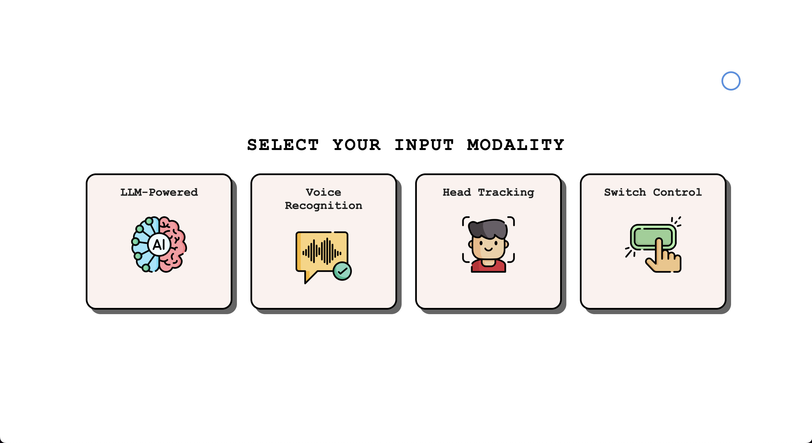
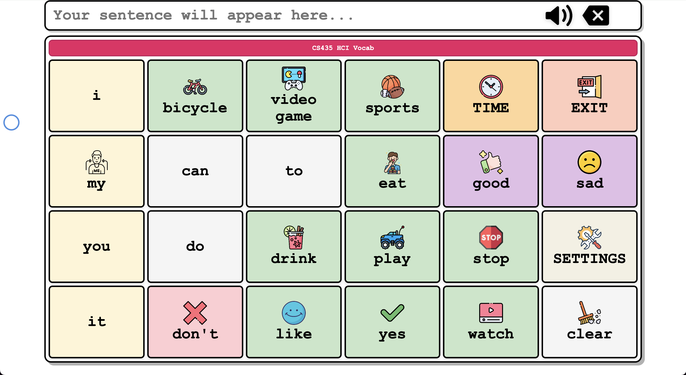

## Setup

```bash
cd App
npm install
npm run dev
```

## Features

### 1. LLM-Based Text Prediction Keyboard

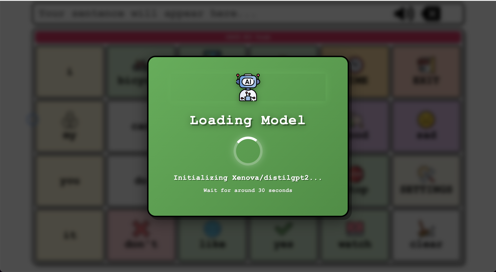
_LLM-powered predictions using Xenova/distilgpt2 from [huggingface/transformers.js](https://github.com/huggingface/transformers.js)_

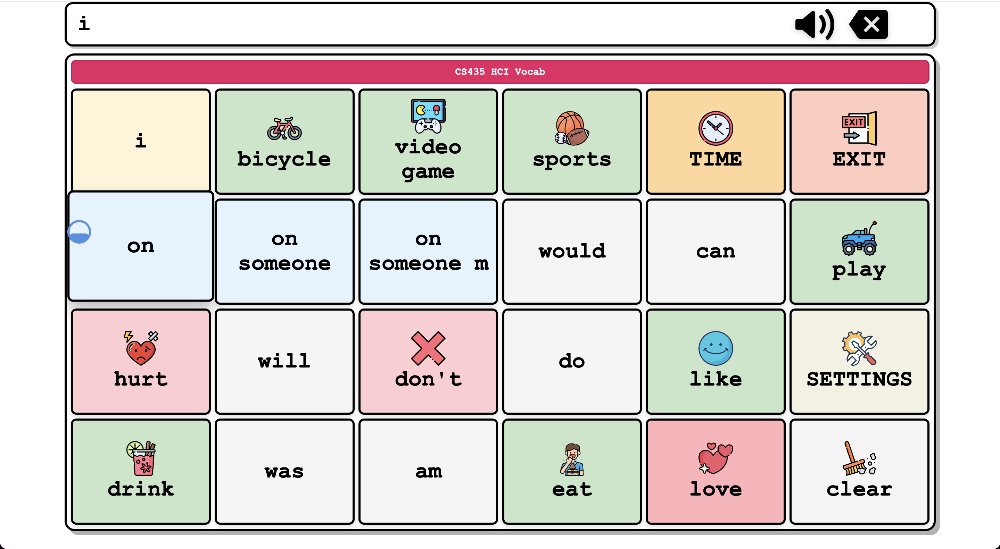
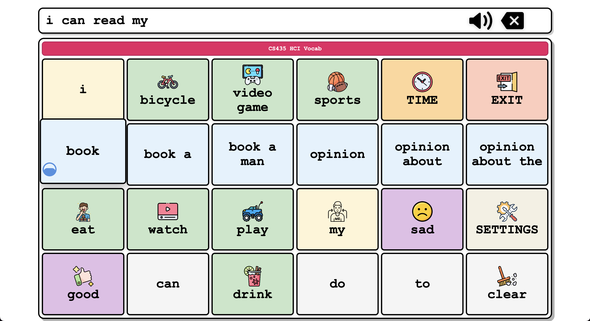
_Blue keys represent the LLM's next word predictions_

### 2. Speech Recognition

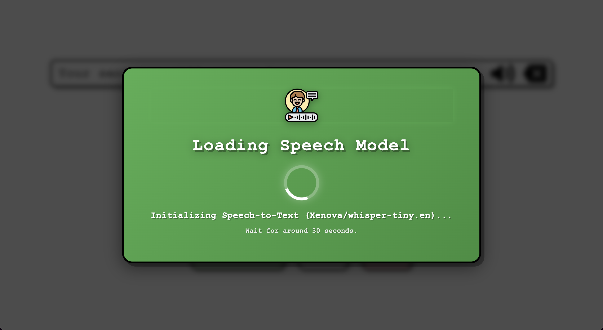
_Speech-to-text using "Xenova/whisper-tiny.en" and text-to-speech using Web Speech API_
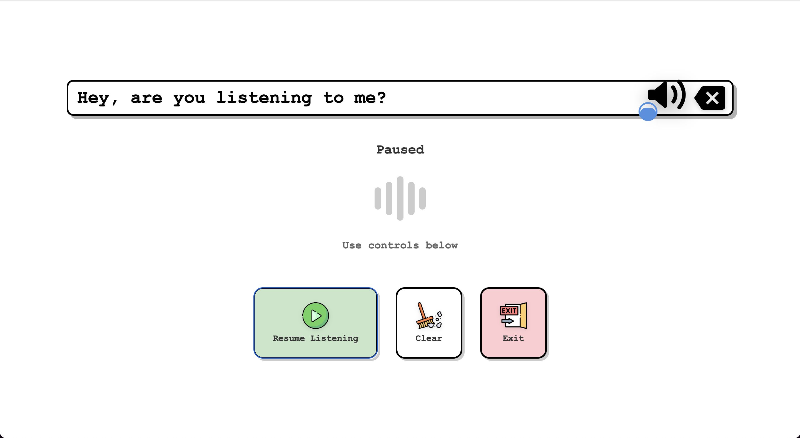
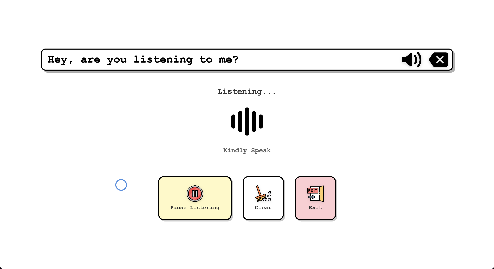

### 3. Head Tracking

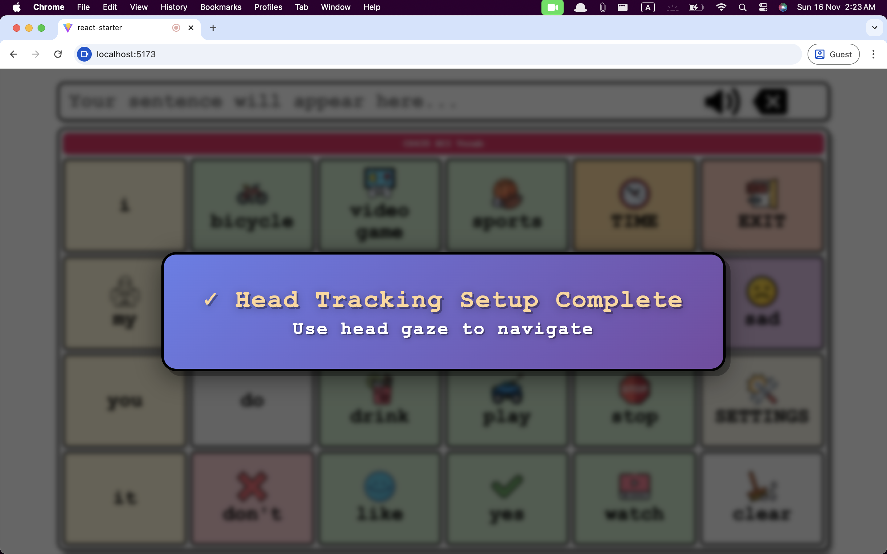

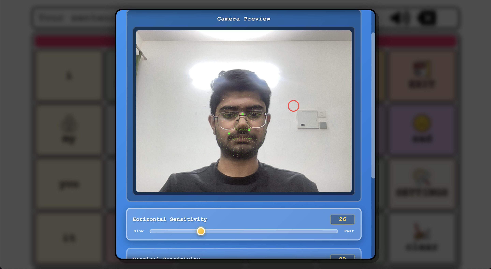

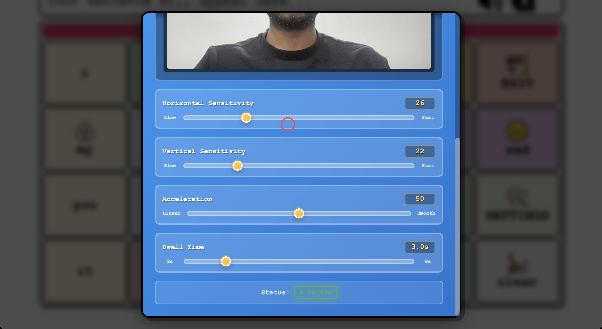
_Head movement-based cursor control using [Tracky-Mouse API](https://github.com/1j01/tracky-mouse)_

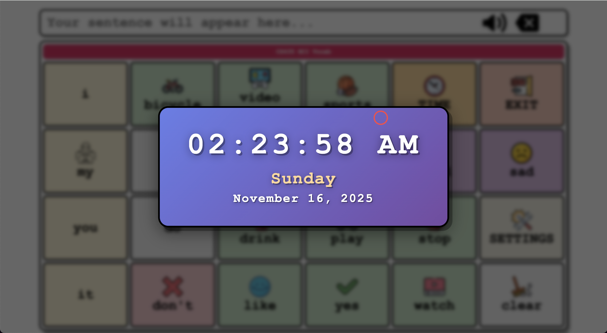

### 4. Switch Control

Single-switch scanning interface for accessibility. Auto-scanning through keyboard rows with individual key highlighting.
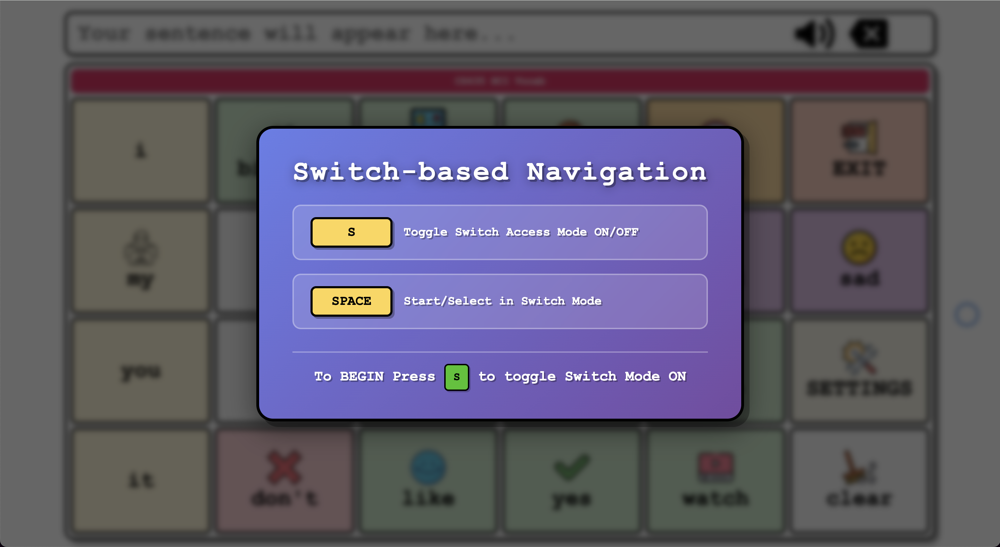

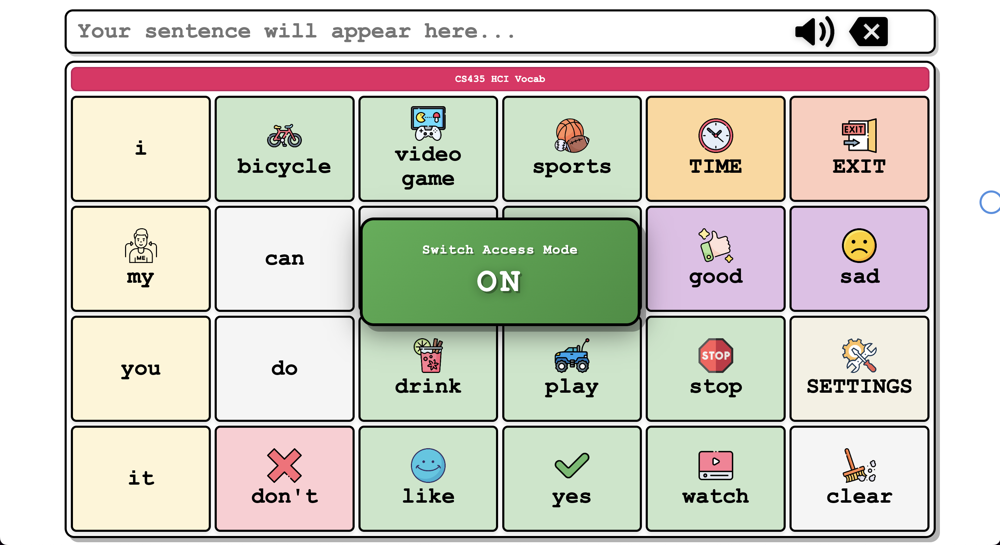

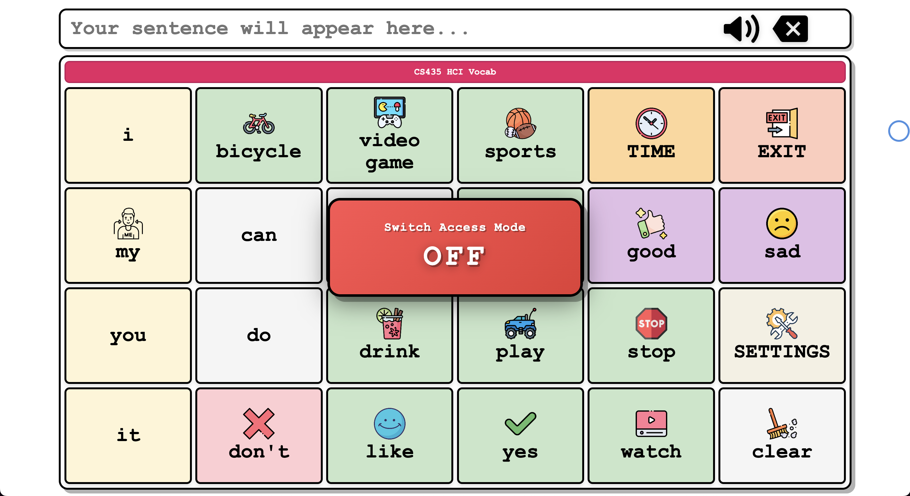

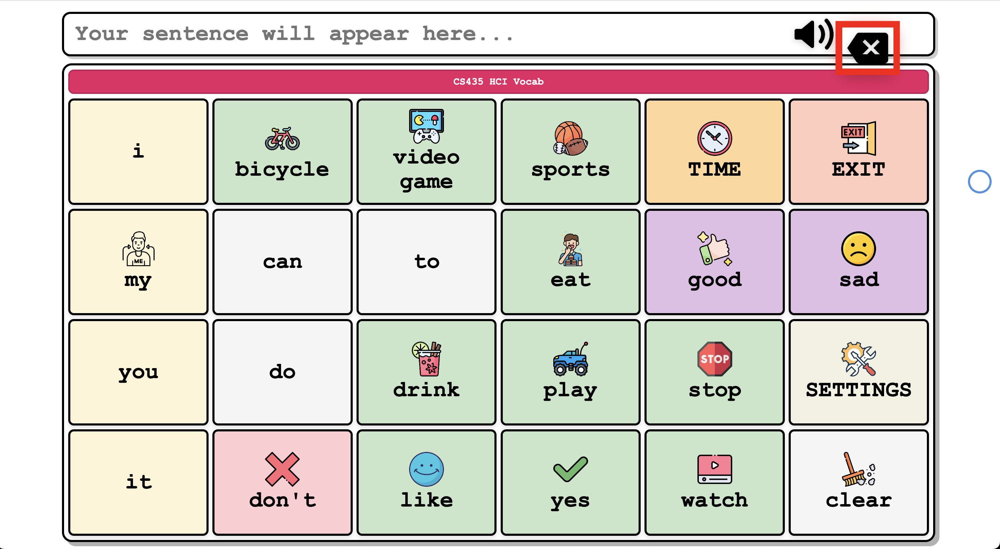

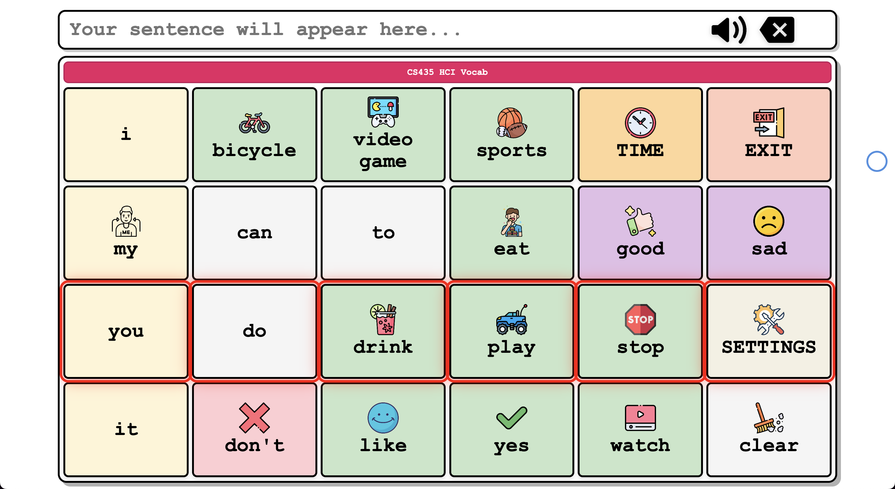

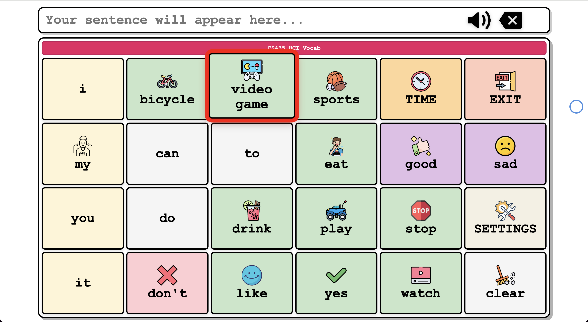
