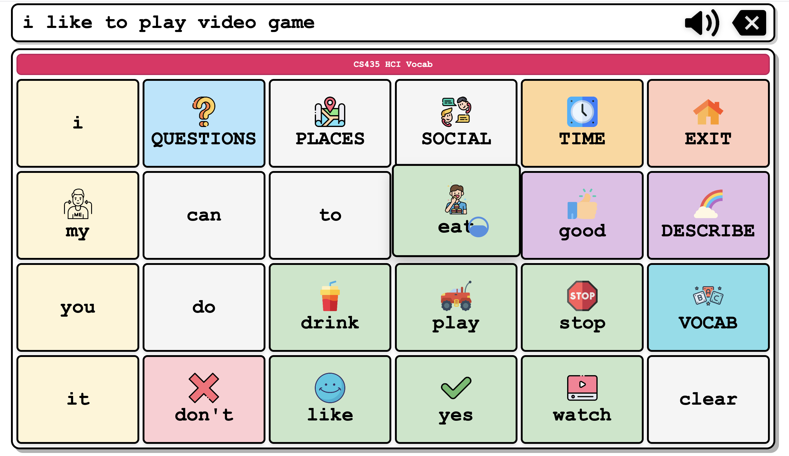

# Multimodal Input App



```
npm install
npm run dev
```

# gaze-and-head-tracker

Minimal starter scripts for head-controlled and eye-gaze-controlled mouse input using MediaPipe.

## Requirements

- Python 3.8+
- Webcam
- Recommended OS: Linux / Windows (X11 on Linux works best for `pyautogui`)

### 1. Install dependencies

```bash
pip install opencv-python mediapipe pyautogui
```

## Usage

```bash
python head_tracking.py    # Head-controlled cursor
python gaze_tracking.py    # Eye-gaze-controlled cursor
```

Press `ESC` or `Q` to quit.
